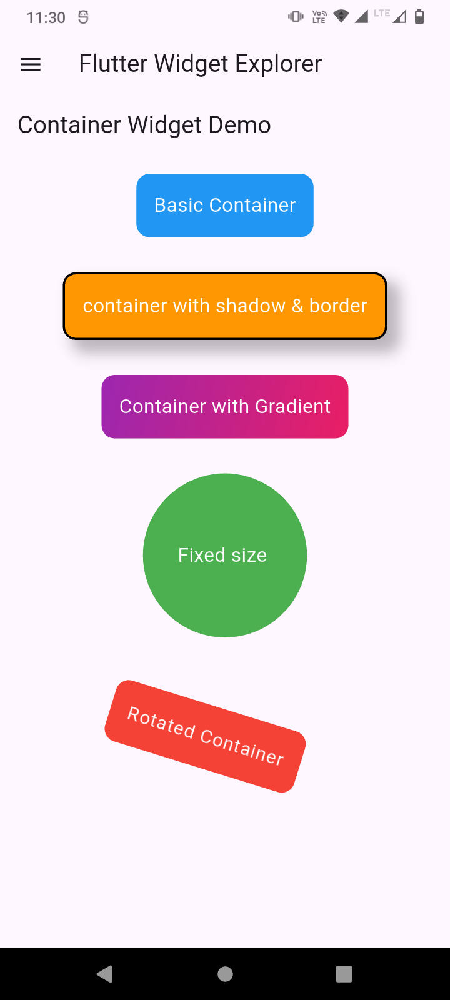
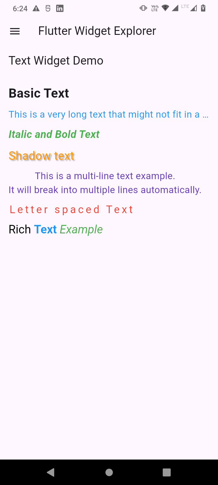
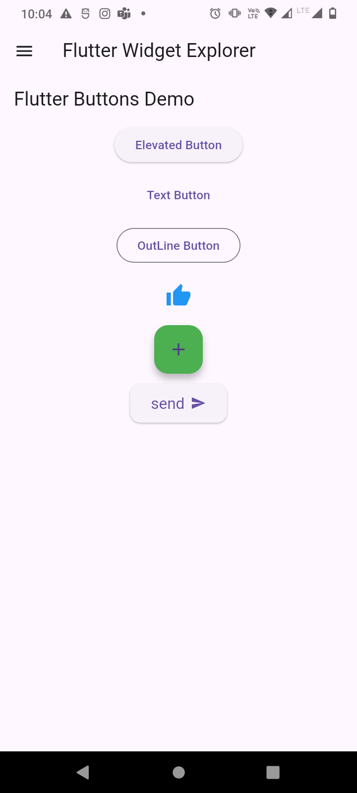

# 📱 Flutter Widget Explorer

Welcome to **Flutter Widget Explorer** — your ultimate resource to master Flutter widgets one by one, with hands-on examples, visual outputs, and real use cases.

This repository helps **Flutter beginners, students, enthusiasts, and developers** understand **what each widget does**, **how it works**, and **how to use it effectively** in real-world applications.

---

## 📌 About This Repository

Flutter provides hundreds of widgets — but which one to use, and when?

This repo breaks that learning curve with:
- 🔍 Deep dives into each widget
- 🧪 Practical code examples
- 🧩 Multiple configurations and variations
- 📸 Visual outputs (Screenshots & GIFs)
- 🗂️ Clear documentation and categories

---

## 🧩 Widget Categories

Flutter widgets are organized into categories for easier exploration:

| Category           | Description |
|--------------------|-------------|
| 🧱 **Basic**        | Fundamental widgets like `Container`, `Text`, `Row`, `Column`, etc. |
| 📦 **Layout**       | Organize child widgets using `Stack`, `Wrap`, `GridView`, etc. |
| 💡 **Input**        | Widgets for user input like `TextField`, `Checkbox`, `Radio`, etc. |
| 🧭 **Navigation**   | Routing and navigation: `Drawer`, `BottomNavigationBar`, `Navigator` |
| 🎨 **Styling**      | Style & theming: `TextStyle`, `Theme`, `Padding`, etc. |
| 🎬 **Animation**    | Motion widgets like `AnimatedContainer`, `Hero`, etc. |
| 💬 **Dialogs**      | Popups: `AlertDialog`, `SnackBar`, `BottomSheet`, etc. |
| 🖼️ **Media**        | Show images and icons: `Image`, `Icon`, etc. |
| 🍏 **Cupertino**    | iOS-specific widgets |
| ⚙️ **Advanced**     | Async and custom: `FutureBuilder`, `StreamBuilder`, `CustomPaint` |

---

## ✅ Widgets Explored So Far

| Widget Name        | Preview | Description |
|--------------------|---------|-------------|
| `Container`        | <div align="center"></div> | The most commonly used layout widget for styling, sizing, and positioning | [View Code](lib/widgets/container_example.dart) |
| `Text`             |  | Display styled text on screen with various configurations | [View Code](lib/widgets/text_example.dart) |
| `Types of Buttons` |  | All major Flutter buttons like `ElevatedButton`, `TextButton`, `OutlinedButton`, `IconButton`, `FloatingActionButton` | [View Code](lib/widgets/buttons_example.dart) |

> More widgets are added regularly. Stay tuned! 🚀

---

## 🛠 How to Run the Code

To run any widget demo on your local machine:

```bash
# Clone the repository
git clone https://github.com/thogaruchesti-hemanth/flutter_widget_explorer.git

# Navigate into the folder
cd flutter_widget_explorer

# Install dependencies
flutter pub get

# Open main.dart or specific widget file and run
flutter run
# Clone the repository
git clone https://github.com/yourusername/flutter_widget_explorer.git

# Navigate into the project directory
cd flutter_widget_explorer

# Open the desired example and run it
flutter run
```

Make sure you have **Flutter installed** on your system. [Get Flutter here](https://flutter.dev/docs/get-started/install) if you haven't already!

## 🤝 Contributions
Want to contribute? Awesome! Here’s how you can help:
1. Fork the repository 🍴
2. Explore a widget 🏗️
3. Add your example & demo 🔥
4. Create a Pull Request 🚀

---

## 🌟 Show Some Love

If this repo helped you:

- ⭐ **Star this repository**
- 🔁 **Share with fellow devs**
- 🤝 **Contribute back**
- 🔔 **Watch for updates**

---

## 👨‍💻 Author

**Thogaruchesti Hemanth**  
GitHub: [@thogaruchesti-hemanth](https://github.com/thogaruchesti-hemanth)  
📧 Email: saihemanth225@gmail.com

---

Happy Exploring Flutter Widgets! 🚀
